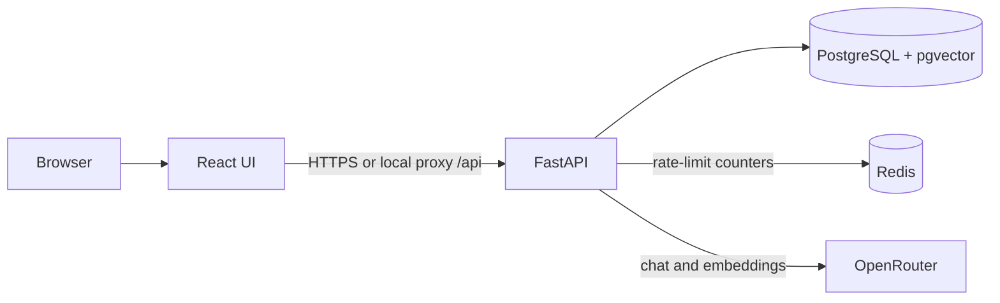
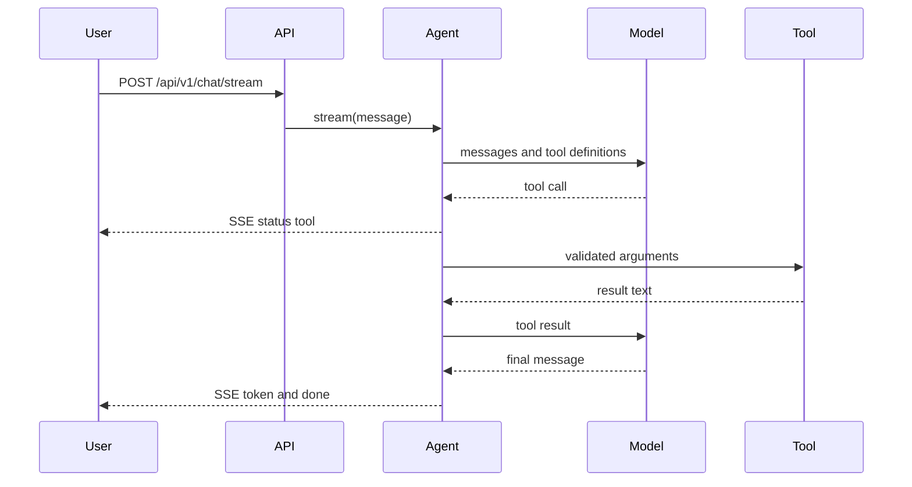
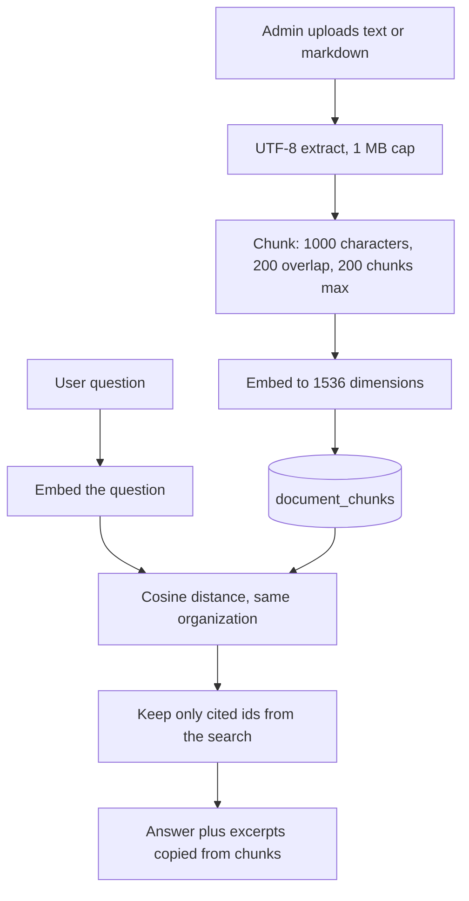
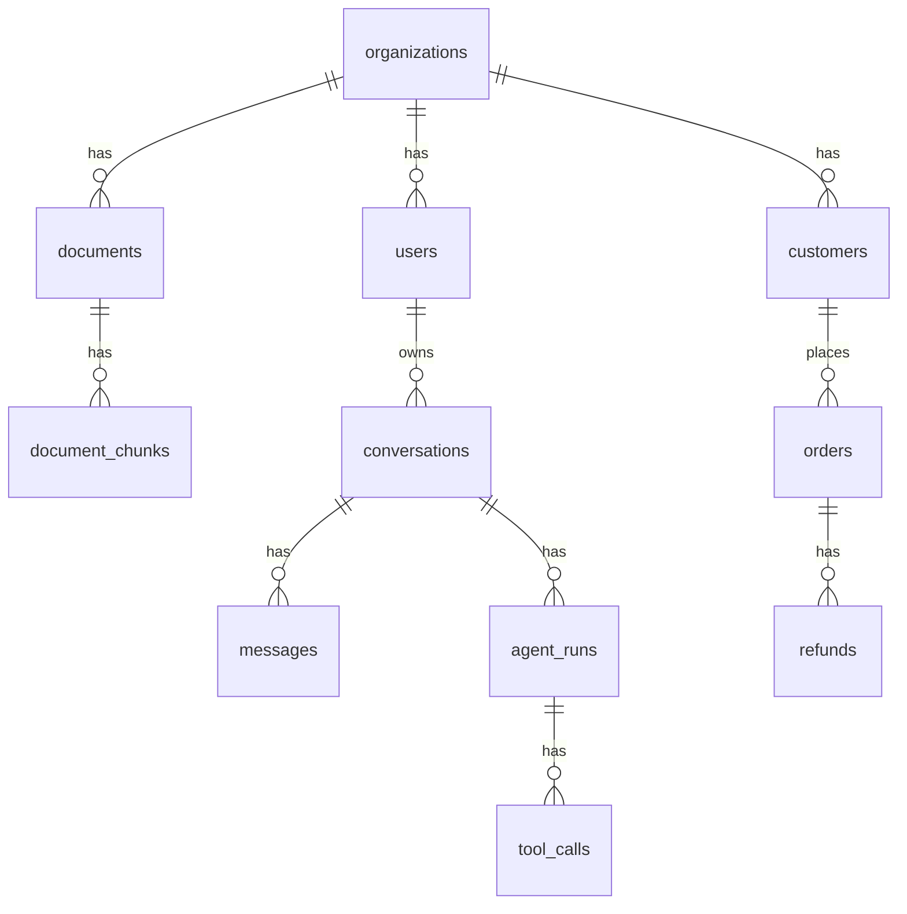
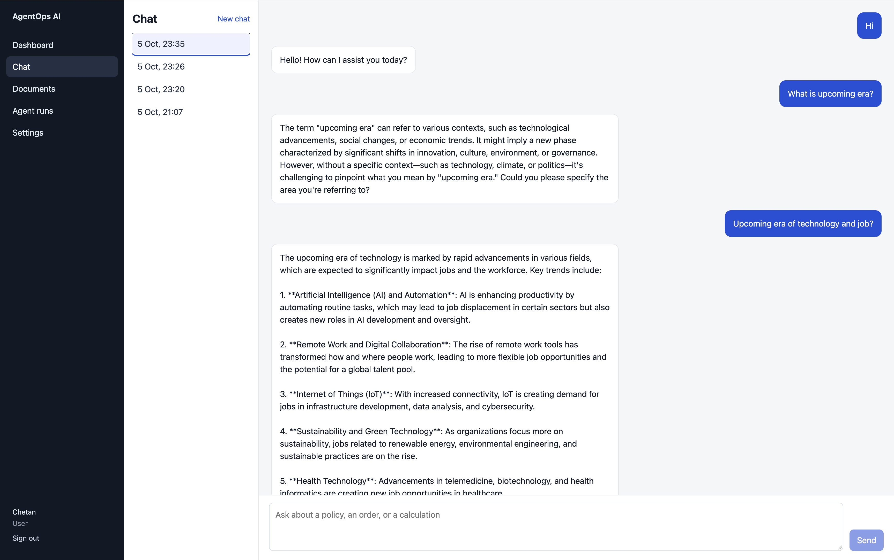
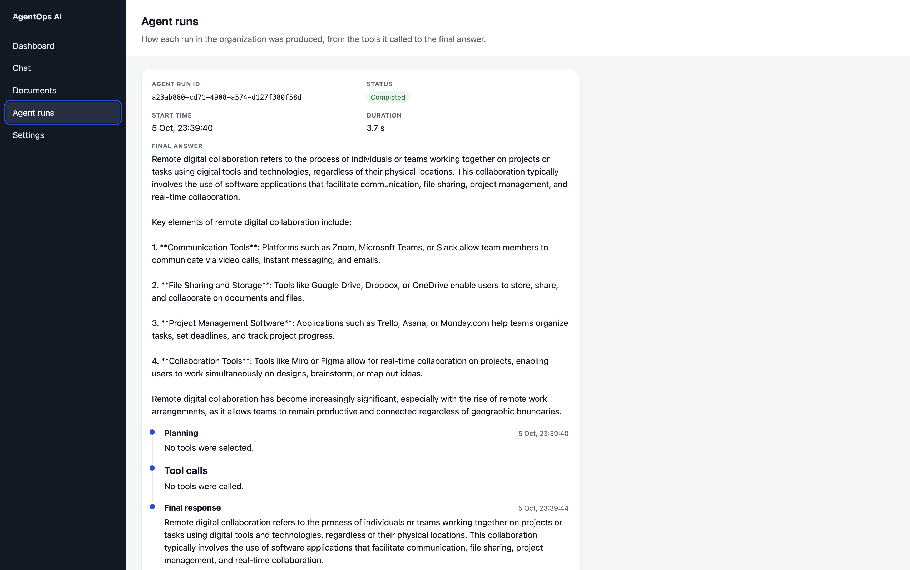
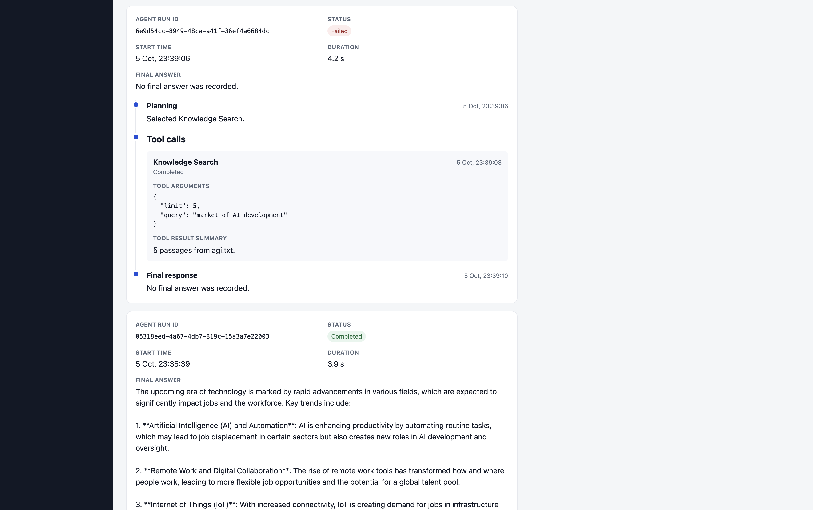
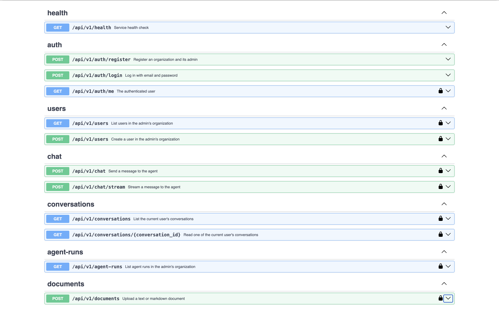

# AgentOps AI

Agentic enterprise knowledge assistant. A signed-in user asks a question. The agent may call a calculator, a fixed set of analytics queries, or a search over documents uploaded for that user's organization. Answers that use document search can cite only passages the search returned.

The repository is a single application: a FastAPI backend, a React frontend, PostgreSQL with pgvector, and Redis for rate-limit counters. It is not a set of microservices.

https://github.com/user-attachments/assets/0acc6927-b133-4d8d-9119-6d5c81505750

## Contents

1. [Project overview](#project-overview)
2. [Problem statement](#problem-statement)
3. [Features](#features)
4. [Architecture](#architecture)
5. [Technology stack](#technology-stack)
6. [Agent architecture](#agent-architecture)
7. [Tool-calling flow](#tool-calling-flow)
8. [RAG architecture](#rag-architecture)
9. [Database architecture](#database-architecture)
10. [Authentication and security](#authentication-and-security)
11. [API](#api)
12. [Local development](#local-development)
13. [Docker development](#docker-development)
14. [Environment variables](#environment-variables)
15. [Testing](#testing)
16. [CI](#ci)
17. [Deployment](#deployment)
18. [Screenshots](#screenshots)
19. [Example agent conversations](#example-agent-conversations)
20. [Engineering decisions](#engineering-decisions)
21. [Future improvements](#future-improvements)

## Project overview

Two roles exist, and they do not overlap.

| Role  | What that account can do                                                                                                                                                                                                               |
| ----- | -------------------------------------------------------------------------------------------------------------------------------------------------------------------------------------------------------------------------------------- |
| Admin | The first registered account is an admin. That account creates users in its organization, uploads `.txt` and `.md` documents, and lists agent runs for the organization. Registration is an API call; the UI has no registration form. |
| User  | Chat with the agent, search that organization's documents through the agent, and read their own conversations.                                                                                                                         |

Chat is available to the user role. An admin token receives 403 on chat and conversation routes, so it cannot use the knowledge tool either. A user token receives 403 on document upload, user management, and agent-run listing. After sign-in the UI navigates to `/chat` for every role. An admin still sees that page, and the API rejects the message.

The chat page streams the reply with server-sent events and shows which tool the agent is calling. The agent-runs page lists recent executions for admins, including redacted tool arguments and short result summaries. The documents page is a placeholder: upload is implemented on the API, and the page does not list or upload files yet. Settings shows the signed-in name, email, and role, and signs the browser out.

Business analytics reads `orders`, `refunds`, and `customers` for the caller's organization. Those tables exist. This repository does not load sample commerce rows, so a new database answers those queries from empty tables.

## Problem statement

An enterprise question is often a mix of arithmetic, operational numbers, and text that already lives in internal documents. A chat box that only talks to a model will invent figures and quotations. A search box that only returns chunks does not calculate or summarize.

AgentOps AI keeps those steps in one request. The model decides whether a tool is needed. The server runs the tool. When the tool is document search, the final answer may name only documents that search returned, and the excerpts shown to the client are copied from those passages.

## Features

Implemented:

- Organization registration and email/password login.
- Admin creation of users in the same organization.
- Chat for the user role, with conversation history stored in PostgreSQL.
- Streaming chat over server-sent events, and a non-streaming JSON chat endpoint.
- Three tools: `calculator`, `analytics`, and `search_knowledge`.
- Document upload (`.txt`, `.md`, `.markdown`), chunking, and embedding into pgvector.
- Grounded answers after knowledge search: citations must be a subset of retrieved document ids.
- Persisted agent runs and tool calls, with an admin timeline in the UI.
- Per-user chat rate limits, per-email sign-in limits, and a shared registration cap.
- OpenAPI docs in development.

Not implemented:

- A documents browser or upload form in the UI.
- A user-management screen. User creation is API-only.
- Listing or deleting documents.
- Loading sample orders for the analytics tool.
- More than one live model provider. The code has a provider interface; the only implementation is OpenRouter.
- A deployment pipeline. CI builds and tests. It does not publish or deploy.

## Architecture



In local Docker, nginx in the frontend container serves the built UI and proxies `/api` to the backend. In local Vite development, the Vite server proxies `/api` to `http://127.0.0.1:8000`. The browser talks to one origin either way.

PostgreSQL is the system of record for users, conversations, messages, documents, chunks, agent runs, and the commerce tables the analytics tool reads. Redis stores only expiring rate-limit counters. Agent state is not stored in Redis.

## Technology stack

| Piece                | Choice                                                                     |
| -------------------- | -------------------------------------------------------------------------- |
| API                  | Python 3.12, FastAPI, Uvicorn, Pydantic                                    |
| UI                   | React 19, TypeScript, Vite, React Router                                   |
| Database             | PostgreSQL 18 with pgvector, SQLAlchemy async, Alembic, asyncpg            |
| Limits               | Redis 8, or an in-process counter when `REDIS_URL` is empty in development |
| Models               | OpenRouter through the OpenAI-compatible SDK                               |
| Passwords and tokens | Argon2id, PyJWT (HS256)                                                    |
| Tests                | Pytest, Vitest, React Testing Library, Playwright                          |
| Containers           | Docker Compose: frontend, backend, Postgres, Redis                         |
| CI                   | GitHub Actions: lint, tests, frontend build, backend image build           |

### Why these pieces

**FastAPI.** The API is async because chat, embeddings, and database calls wait on the network. FastAPI runs that code on the asyncio loop, validates request bodies with the same Pydantic models the handlers use, and publishes OpenAPI from those models. That keeps the HTTP edge thin and the agent code independent of the framework.

**PostgreSQL.** Users, conversations, documents, and agent runs are relational and must stay consistent with each other. One database can enforce the foreign keys and the email uniqueness constraint, and it can filter every query by organization. The application does not split that data across stores.

**pgvector.** Document search is a nearest-neighbour lookup over embeddings that belong to the same rows as the chunk text. Keeping the vector column on `document_chunks` means the organization filter, the chunk text, and the similarity ordering happen in one query. A separate vector database would duplicate the tenant boundary this application already has in PostgreSQL.

**Redis.** Chat, login, and registration limits must be shared by every API process, and the counter only needs to live until the window expires. Redis `INCR` with a TTL does that. PostgreSQL remains the source of truth. Development can leave `REDIS_URL` empty and use the same window rules in memory. Production refuses to start without Redis, and a Redis error fails the request closed so the limit cannot be skipped.

**Tool calling.** Some answers are exact: an arithmetic result, a revenue total, a passage from an uploaded file. The model is asked to call a named tool instead of producing those values itself. The server validates the arguments and runs a fixed function. The analytics tool exposes four predefined operations. The model does not send SQL.

**RAG.** Uploaded documents are the source for questions the model was not trained on. Retrieval finds a few passages; the model writes the answer from those passages. After `search_knowledge`, the server accepts the answer only when every cited document id was in the tool result, and it copies the excerpts from the stored chunks. If the model cites nothing, the client receives "I do not have enough information to answer that."

**Provider abstraction.** Agent orchestration depends on an `LLMProvider` interface (`generate` / `stream`), not on the OpenRouter SDK. Tests use an in-memory fake. The running application constructs an OpenRouter provider from `LLM_PROVIDER=openrouter`. Adding another vendor means another implementation of that interface. No second vendor is included.

**SSE.** The chat UI needs a stream of status lines and tokens for a single request that already carries a bearer token. Server-sent events are a one-way response on `POST /api/v1/chat/stream`, which `fetch` can read. The browser `EventSource` API cannot send that `POST` or the `Authorization` header, so the client uses `fetch` and a `ReadableStream`. WebSockets are not used. `POST /api/v1/chat` still returns one JSON body for clients that do not stream.

## Agent architecture

`AgentService` owns the loop. It does not import FastAPI or the OpenRouter client. The HTTP layer builds the service from the signed-in user: the tool registry receives that user's organization id, and the knowledge tool is added only when an embedding provider is configured.

Each user message is one run:

1. Persist a user message and an agent run in `running` status, when a database is configured.
2. Send the conversation so far, plus tool definitions, to the provider.
3. If the provider returns tool calls, execute them, append the results, and ask the model again.
4. Stop when the model returns a final message, or after 5 steps.
5. If `search_knowledge` ran, parse the final message as `{"answer", "document_ids"}` and ground it. Otherwise keep the text, unwrapping that JSON only when `document_ids` is empty.
6. Store the assistant message and mark the run completed, or mark the run failed without an assistant message.

The system prompt tells the model to call a tool when a tool can answer exactly, and to say when it does not know. Knowledge-answer instructions are appended only when `search_knowledge` is registered. They start by telling the model to reply in plain text if it did not search.

Live tokens are forwarded only while the step has not called a tool, knowledge search was not used, and the buffered text does not look like the JSON envelope. If a tool starts after partial text, the UI clears that text. The grounded answer replaces it when the canonical text differs.

Closing the stream before the run finishes marks the run failed. A disconnect is not sent to the client as an error body.

## Tool-calling flow



| Tool               | Who can reach it                                   | What it does                                                                                                                                                                                                                                           |
| ------------------ | -------------------------------------------------- | ------------------------------------------------------------------------------------------------------------------------------------------------------------------------------------------------------------------------------------------------------ |
| `calculator`       | Any chat request                                   | Evaluates a numeric expression with an operator allowlist. It does not call `eval`. Magnitude and exponent size are capped.                                                                                                                            |
| `analytics`        | Chat, when the database and organization are known | Runs one of `get_revenue_summary`, `get_order_summary`, `get_refund_summary`, `get_top_customers`. Dates are inclusive UTC days. Amounts are not mixed across currencies. The query runs in a read-only transaction with a 5 second statement timeout. |
| `search_knowledge` | Chat, when embeddings are configured               | Embeds the query, then cosine-searches that organization's chunks. The query is embedded before the read-only transaction opens. Limit is 1–10 passages.                                                                                               |

Tool errors go back to the model as tool results so it can recover inside the step limit. Unexpected tool failures are logged and returned as a failed tool result. Arguments that look like secrets (`api_key`, `password`, `token`, bearer values, and similar) are redacted before an agent run is shown in the API.

## RAG architecture



Upload accepts `.txt`, `.md`, and `.markdown`. The stored name is the file name only. NUL bytes, empty text, and non-UTF-8 bytes are rejected. Markdown chunks try to keep a heading with its section; long sections are windowed. Embeddings use the configured OpenRouter embedding model and must be 1536-dimensional, which matches the `document_chunks.embedding` column. `openai/text-embedding-3-small` is the example in `.env.example`.

Similarity is `1 - cosine distance`, clamped to `[0, 1]`, and rounded to 4 decimal places. Search never takes an organization id from the model or the request body.

If `EMBEDDING_MODEL` or `OPENROUTER_API_KEY` is unset, the knowledge tool is omitted and upload returns an error that embeddings are not configured. The rest of the API still starts.

## Database architecture



| Table                            | Role                                                                                        |
| -------------------------------- | ------------------------------------------------------------------------------------------- |
| `organizations`                  | Tenant.                                                                                     |
| `users`                          | Email is unique globally. Role is `admin` or `user`. Password column stores an Argon2 hash. |
| `conversations`, `messages`      | A conversation belongs to one user. Messages are user or assistant text.                    |
| `agent_runs`, `tool_calls`       | One run per chat request, with tool name, arguments, status, and timestamps.                |
| `documents`, `document_chunks`   | Uploaded file metadata and chunk text. The chunk embedding is a pgvector column.            |
| `customers`, `orders`, `refunds` | Rows the analytics tool aggregates. Scoped by `organization_id`.                            |

Alembic is the schema history. The backend container runs `alembic upgrade head` before Uvicorn starts. Conversation lists return 50 threads. A conversation detail returns the latest 200 messages. Agent-run and user lists are capped at 50 and 200.

## Authentication and security

- Passwords are hashed with Argon2id. The hash is never returned. Login of an unknown email still runs a verify against a dummy hash.
- Access tokens are HS256 JWTs with `sub` (user id) and `exp`. The algorithm list is locked to HS256. The token does not carry a role. Default lifetime is 60 minutes, configurable from 1 to 1440 minutes.
- `JWT_SECRET` must be at least 32 characters and is required in production.
- Registration is open: the first user creates an organization and becomes its admin. A duplicate email returns 409, including when two requests insert the same email together.
- Sign-in and registration are limited per email (default 10 per 5 minutes). Registration also has a shared cap (default 20 per minute). Chat is limited per user (default 20 per minute) across `POST /chat` and `POST /chat/stream`.
- Production rejects `DEBUG=true`, `DATABASE_ECHO=true`, a CORS origin of `*`, a missing JWT secret, and a missing Redis URL. API docs are disabled in production.
- CORS allows the configured origins and does not allow credentials. The token is sent in the `Authorization` header.
- Request bodies are rejected above about 1 MB before parsing. Document bytes are capped at 1,000,000.
- Unhandled exceptions return a generic 500. Provider and Redis logs record the failure type or HTTP status, not the response body.
- The nginx frontend sends `X-Content-Type-Options: nosniff`, `X-Frame-Options: DENY`, and `Referrer-Policy: no-referrer`.

The browser stores the access token in `localStorage`. There is no refresh token and no server-side revocation list. A stolen token works until it expires.

## API

Base path: `/api/v1`. Development serves interactive docs at `/docs`. Errors use one shape:

```json
{ "error": { "code": "unauthorized", "message": "…", "details": null } }
```

| Method | Path                  | Auth               | Purpose                                                                             |
| ------ | --------------------- | ------------------ | ----------------------------------------------------------------------------------- |
| `GET`  | `/health`             | Public             | `{"status":"ok"}` when the process is serving. It does not check Postgres or Redis. |
| `POST` | `/auth/register`      | Public             | Create an organization and its admin. Returns a bearer token.                       |
| `POST` | `/auth/login`         | Public             | Exchange email and password for a bearer token.                                     |
| `GET`  | `/auth/me`            | Any signed-in user | The current user.                                                                   |
| `GET`  | `/users`              | Admin              | Users in the admin's organization, up to 200.                                       |
| `POST` | `/users`              | Admin              | Create a user in that organization.                                                 |
| `POST` | `/chat`               | User               | One JSON `ChatResponse`.                                                            |
| `POST` | `/chat/stream`        | User               | SSE events: `status`, `token`, `done`, `error`.                                     |
| `GET`  | `/conversations`      | User               | That user's conversations, up to 50.                                                |
| `GET`  | `/conversations/{id}` | User               | That conversation, or 404 if it belongs to someone else. Latest 200 messages.       |
| `GET`  | `/agent-runs`         | Admin              | Latest 50 runs in the organization.                                                 |
| `POST` | `/documents`          | Admin              | Multipart upload of one text or markdown file.                                      |

`POST /chat` and `POST /chat/stream` take:

```json
{ "message": "What is 6 * 7?", "conversation_id": null }
```

`message` is 1–8000 characters. `conversation_id` is optional. A successful chat response includes `answer`, `sources`, `tools_used`, and, when the database is configured, `conversation_id` and `run_id`.

Stream `done` is that same object. `status` is `thinking`, `tool` (with the tool name), or `generating`. `token` is `{ "text", "replace" }`. After the response has started, a failure is an `error` event rather than an HTTP error. Auth failures, validation, an unknown conversation, and rate limits are HTTP responses before the stream: 401, 403, 404, 422, 429, or 503.

Send `Authorization: Bearer <token>` on every route except health, register, and login.

## Local development

Requires Python 3.12, Node.js 22, and PostgreSQL with pgvector. Redis is optional on this path.

```bash
docker compose up -d postgres
cd backend
python3.12 -m venv .venv
source .venv/bin/activate
pip install -r requirements-dev.txt
cp .env.example .env
```

Set `JWT_SECRET` in `backend/.env` to at least 32 characters. Set `OPENROUTER_API_KEY` when you want live model calls. Leave `EMBEDDING_MODEL` empty to run without document search. Leave `REDIS_URL` empty to rate-limit in this process.

```bash
alembic upgrade head
uvicorn app.main:app --reload --port 8000
```

In another shell:

```bash
cd frontend
npm ci
npm run dev
```

Leave `frontend/.env` as `VITE_API_BASE_URL=` so the browser calls the Vite proxy at `http://127.0.0.1:5173` and Vite forwards `/api` to port 8000. The UI is [http://127.0.0.1:5173](http://127.0.0.1:5173) . API docs are [http://127.0.0.1:8000/docs](http://127.0.0.1:8000/docs) .

Create the first organization with `POST /api/v1/auth/register`. That account is an admin. Create a user with `POST /api/v1/users` using the admin token, then sign in as that user to chat. The sign-in page does not register accounts.

Database tests expect `TEST_DATABASE_URL` to end in `_test`. `docker/postgres/init/01-create-test-database.sql` creates `agentops_test` when the Postgres volume is first initialized.

## Docker development

Compose runs four containers: frontend, backend, Postgres, and Redis. Postgres stores the application data. Redis stores rate-limit counters and has no volume. Passwords and `JWT_SECRET` come from a root `.env` file. `docker-compose.yml` references the names and does not contain the secret values.

```bash
cp .env.example .env
docker compose up --build
```

`JWT_SECRET` must be at least 32 characters. Chat reaches the model only when `OPENROUTER_API_KEY` is set. The stack still starts without it.

| Service    | URL                                                                        |
| ---------- | -------------------------------------------------------------------------- |
| Frontend   | [http://localhost:5173](http://localhost:5173)                             |
| API health | [http://localhost:8000/api/v1/health](http://localhost:8000/api/v1/health) |
| API docs   | [http://localhost:8000/docs](http://localhost:8000/docs)                   |

Published ports bind to `127.0.0.1`. The frontend container proxies `/api` to the backend, so the browser stays on port 5173. On startup the backend applies migrations, then serves the API.

```bash
docker compose down
```

`postgres-data` is kept. Redis counters are dropped when that container stops. `docker compose down -v` deletes the database volume as well.

## Environment variables

Root `.env.example` is for Compose. `backend/.env.example` is for a process you start yourself. `frontend/.env.example` only sets `VITE_API_BASE_URL`.

| Variable                                                             | Where    | Purpose                                                                                              |
| -------------------------------------------------------------------- | -------- | ---------------------------------------------------------------------------------------------------- |
| `POSTGRES_USER`, `POSTGRES_PASSWORD`, `POSTGRES_DB`, `POSTGRES_PORT` | Compose  | Database credentials and host port.                                                                  |
| `REDIS_PORT`                                                         | Compose  | Host port for Redis. The backend inside Compose uses `redis://redis:6379/0`.                         |
| `JWT_SECRET`                                                         | Both     | HMAC key, at least 32 characters. Required in production.                                            |
| `OPENROUTER_API_KEY`                                                 | Both     | Model and embedding key. Empty means chat cannot call the model.                                     |
| `LLM_MODEL`                                                          | Both     | OpenRouter model slug. Default `openai/gpt-4o-mini`.                                                 |
| `EMBEDDING_MODEL`                                                    | Both     | Embedding slug that returns 1536 dimensions. Empty disables knowledge search and upload.             |
| `CORS_ORIGINS`                                                       | Both     | Comma-separated browser origins. `*` is rejected in production.                                      |
| `FRONTEND_PORT`, `BACKEND_PORT`                                      | Compose  | Host ports. Defaults 5173 and 8000.                                                                  |
| `ENVIRONMENT`                                                        | Backend  | `development` or `production`.                                                                       |
| `DEBUG`                                                              | Backend  | Must be false in production.                                                                         |
| `DATABASE_URL`                                                       | Backend  | `postgresql+asyncpg://…`. Empty starts the API without a database.                                   |
| `DATABASE_ECHO`                                                      | Backend  | SQL logging. Must be false in production.                                                            |
| `TEST_DATABASE_URL`                                                  | Backend  | Pytest database. The name must end in `_test`.                                                       |
| `JWT_ACCESS_TOKEN_MINUTES`                                           | Backend  | 1–1440. Default 60.                                                                                  |
| `REDIS_URL`                                                          | Backend  | `redis://` or `rediss://`. Empty in development uses memory. Required in production.                 |
| `CHAT_RATE_LIMIT_REQUESTS`, `CHAT_RATE_LIMIT_WINDOW_SECONDS`         | Backend  | Shared budget for both chat routes. Default 20 per 60 seconds.                                       |
| `AUTH_RATE_LIMIT_REQUESTS`, `AUTH_RATE_LIMIT_WINDOW_SECONDS`         | Backend  | Per email. Default 10 per 300 seconds.                                                               |
| `REGISTER_RATE_LIMIT_REQUESTS`, `REGISTER_RATE_LIMIT_WINDOW_SECONDS` | Backend  | Shared registration cap. Default 20 per 60 seconds.                                                  |
| `LLM_TIMEOUT_SECONDS`, `LLM_MAX_RETRIES`                             | Backend  | Provider client timeout and retries. Defaults 60 and 2.                                              |
| `LLM_PROVIDER`                                                       | Backend  | `openrouter` is the only supported value.                                                            |
| `OPENROUTER_BASE_URL`                                                | Backend  | Default `https://openrouter.ai/api/v1`.                                                              |
| `VITE_API_BASE_URL`                                                  | Frontend | Empty in Vite dev so the proxy is used. The Docker build sets it empty because nginx proxies `/api`. |
| `DEFAULT_ORGANIZATION_ID`                                            | Backend  | Accepted so older env files still load. Authorization does not use it.                               |

Do not commit `.env` files.

## Testing

External model calls are mocked. Pytest uses an in-memory provider. Playwright mocks `/api/v1`. No test needs a paid API key.

```bash
make test-backend-lint   # ruff
make test-backend         # pytest
make test-backend-api     # HTTP tests
make test-backend-service
make test-backend-agent
make test-backend-tool
make test-backend-db      # skips when Postgres is down, fails in CI
make test-frontend        # vitest
make test-e2e             # Playwright; installs Chromium on first run
make test                 # backend, frontend, and e2e
```

Backend commands expect `backend/.venv`. Database tests use `TEST_DATABASE_URL`. Frontend unit tests do not start the API. The Playwright test signs in, sends a question, and waits until the mocked stream shows a tool and a final answer.

## CI

`.github/workflows/ci.yml` runs on pull requests and pushes to any branch. It does not deploy.

Three jobs run in parallel:

1. Backend: Ruff, then Pytest against `pgvector/pgvector:pg18` with database `agentops_test`.
2. Frontend: `npm ci`, Vitest, and the production build.
3. Backend image: `docker build` of `backend/`, without pushing.

Playwright is not part of CI. The workflow sets no AI API key.

## Deployment

Nothing in this repository deploys the application. CI builds the backend image and discards it.

A production process is the same backend container, with `ENVIRONMENT=production` and the checks in [Authentication and security](#authentication-and-security). The container applies migrations and listens on port 8000. The frontend image is nginx serving the static build and proxying `/api`. Compose publishes those ports on `127.0.0.1` for local use. A public host needs TLS in front of that proxy, a real `JWT_SECRET`, a Redis URL, an explicit `CORS_ORIGINS` list, and an OpenRouter key if chat or embeddings should run.

`/api/v1/health` only means the API process accepted the request. Postgres and Redis have their own checks in Compose.

## Screenshots

### Chat

A signed-in user talking to the agent. The sidebar lists earlier conversations.



### Agent run

An admin view of a completed run: status, duration, the final answer, and the planning, tool-call, and response steps.



### Failed agent run

A run that selected knowledge search, retrieved passages, and still finished with status Failed and no recorded answer. A completed run is listed below it.



### API docs

The development OpenAPI page: health, auth, users, chat, conversations, agent runs, and documents.



The screens a signed-in browser can open are:

| Screen     | What it shows today                                                                                                           |
| ---------- | ----------------------------------------------------------------------------------------------------------------------------- |
| Sign in    | Email and password. There is no registration form.                                                                            |
| Dashboard  | Greeting and links to chat, documents, and agent runs.                                                                        |
| Chat       | Message list, composer, and the tool activity for the current reply. User role only; an admin receives an error from the API. |
| Documents  | A short explanation and the text "No documents are listed here yet."                                                          |
| Agent runs | A timeline of recent runs for an admin: status, tools, and the final answer.                                                  |
| Settings   | Name, email, role, and sign out.                                                                                              |

## Example agent conversations

These are illustrations of paths the code implements. Wording from the model varies. Tool results do not.

**Arithmetic.** A user asks "What is 6 \* 7?" The model calls `calculator`. The tool returns 42. The answer is plain text, `sources` is empty, and `tools_used` contains `calculator`. The stream shows a thinking status, then a calculator status, then the answer.

**Documents.** An admin has uploaded a markdown file that says the refund window is 30 days. A user asks "How long is the refund window?" The model calls `search_knowledge`. If it returns a JSON answer whose `document_ids` are all from that search, the client receives the answer text and excerpts copied from the chunks. If it returns an empty `document_ids` list, the client receives exactly: "I do not have enough information to answer that."

**Analytics.** A user asks for revenue last month. The model calls `analytics` with `get_revenue_summary` and a date range. The tool returns totals from that organization's orders and refunds. On a database with no commerce rows, those totals are empty. The answer stays plain text and does not cite documents.

## Engineering decisions

- One deployable API and one UI, so a chat request can open a database session, call a tool, and stream tokens without a network hop between internal services.
- The organization id is taken from the user row loaded for the token. Tools and document writes cannot be pointed at another tenant by the body or the model.
- Admin and user permissions are disjoint so the account that manages documents is not the account that chats, and the reverse.
- Knowledge answers are grounded in the server. The model proposes document ids; the server fills excerpts from tool output.
- The analytics tool is a closed set of queries. That is the SQL injection boundary: the model picks an operation name and dates, and SQLAlchemy binds the parameters.
- The calculator parses an expression tree. It is a tool so the model does not do the arithmetic in prose.
- Redis is limited to rate-limit keys. There is no cache of documents or agent runs, because those reads must match PostgreSQL and are not hot enough to justify a second copy.
- Streaming is SSE on a `POST` so the existing bearer token and JSON body keep working. The non-streaming route remains for simple clients.
- The OpenRouter SDK sits behind `LLMProvider` so the agent tests never call the network.
- Request size, statement timeouts, and provider timeouts are bounded in the application. There is no separate gateway configuration in this repo beyond the nginx timeouts in the frontend image.
